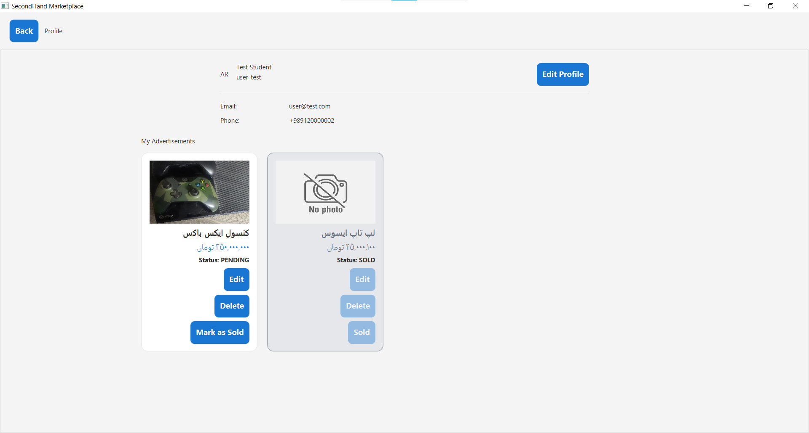
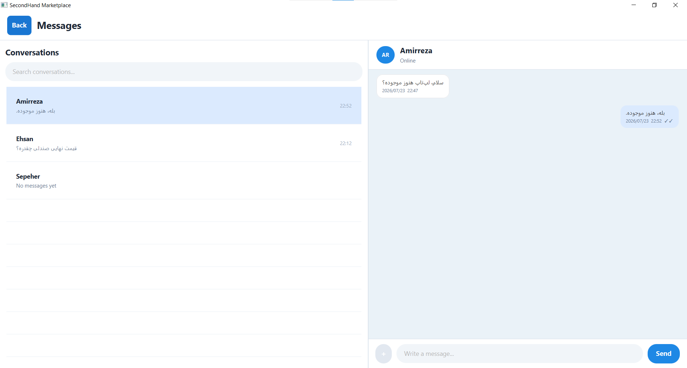
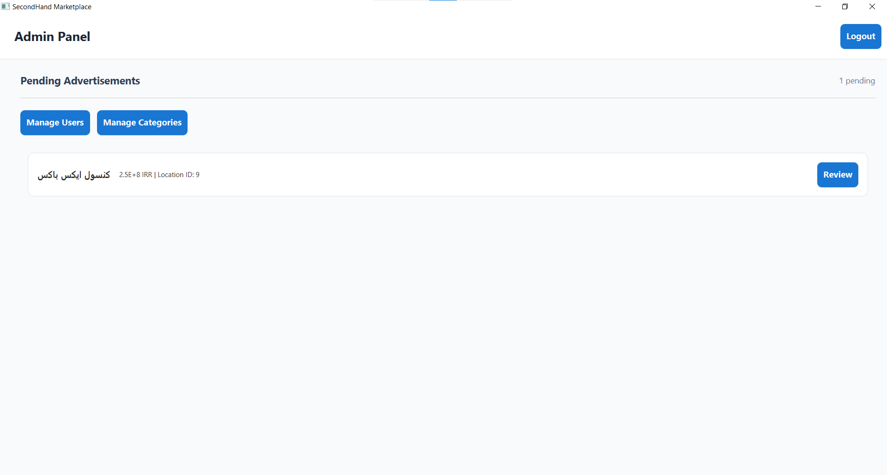

# 🛒 AUT Secondhand Marketplace

A comprehensive, localized peer-to-peer marketplace platform tailored for students at Amirkabir University of Technology (Tehran Polytechnic). This system facilitates secure item listings, real-time in-app messaging, advanced administrative user management, and trusted seller rating systems.


## 👥 Project Contributors & Roles

This project was successfully designed and developed by our two-member team, splitting responsibilities between the backend infrastructure and frontend user experience:

## 👥 Project Contributors & Roles

This project was successfully designed and developed by our two-member team, splitting responsibilities between the backend infrastructure and frontend user experience:

*   **Amirreza Ghasemi**
    *   **Role:** Frontend Developer (Java, JavaFX)
    *   **Student ID:** `40431426`
    *   **Contributions:** Designed and implemented the complete desktop user interface using JavaFX and FXML. Structured the client-side architectural routing, built dynamic view components for listing catalogs, integrated the client-side REST endpoint communication controllers, and designed intuitive user views for the real-time peer-to-peer chat interface and student rating dashboards.
*   **Ehsan Ahmadi**
    *   **Role:** Backend Developer (Java, Spring Boot, PostgreSQL)
    *   **Student ID:** `40431065`
    *   **Contributions:** Engineered the monolithic backend core architecture utilizing Spring Boot and Spring Security with JWT authentication. Designed the relational PostgreSQL database schema, optimized JPA/Hibernate persistence workflows, enforced strict role-based access controls, and implemented the core business logic handling advertisement lifecycles, message delivery tracking, and administrative content moderation workflows.


## ⚙️ Backend Setup & Execution

### Prerequisites
Make sure you have the following installed on your local machine:
*   **Java Development Kit (JDK) 17**
*   **Apache Maven**
*   **Docker & Docker Compose**

### Step 1: Environment Configuration (`.env`)
Create a `.env` file based on the template below to configure the database credentials. This file must be placed in the same directory as your `docker-compose.yml` file.

```env
# Database Credentials Template
POSTGRES_DB=secondhand_db
POSTGRES_USER=postgres
POSTGRES_PASSWORD=your_secure_password
# pgAdmin Credentials Template (optional)
PGADMIN_EMAIL=your_email
PGADMIN_PASSWORD=your_password
# JWT Credentials Template
JWT_SECRET_KEY=your_secret_key
```

### Step 2: Spin Up Infrastructure (Docker)
We use Docker Compose to orchestrate our infrastructure (PostgreSQL and pgAdmin). Run the following command to start the containers in detached mode while explicitly passing your custom environment file:

```bash
docker compose --env-file .env up -d
```

### Step 3: Run the Spring Boot Application
Once the database container is fully up and accepting connections, navigate to the backend directory and run the application using Maven:

```bash
cd backend
mvn spring-boot:run
```
The server will boot up and listen for REST API requests on `http://localhost:8080`. pgAdmin is also available on `http://localhost:5050`.


## 💻 Frontend Setup & Execution (Desktop Application)

### Prerequisites
Since the frontend is a desktop application built with **JavaFX**, it shares the same environment requirements as the backend:
*   **Java Development Kit (JDK) 17**
*   **Apache Maven**


### Step 1: Run the JavaFX Application
Navigate to the frontend directory and execute the application using the JavaFX Maven plugin:

```bash
cd frontend
mvn javafx:run
```

*Note: This will compile the desktop interface, hook up the FXML layouts, and launch the standalone GUI application window on your machine.*

## 💾 Storage Strategy & Test Accounts

### Automated Data Seeding
To streamline development and ensure a plug-and-play setup, **all essential initial data and verified test accounts are automatically seeded into the database** on the very first application startup.
* **Seamless Initialization:** The backend dynamically checks table counts on boot. If the database is clean, the seeding process automatically triggers to prepopulate the system.
* **Hierarchical Setup: All initial** geographical locations (states and cities) and core marketplace categories (along with their rigorous multi-line JSON validation schemas) are injected while strictly preserving their object-oriented parent-child relationships

### Image Storage Mechanism
Product and advertisement images uploaded by users are stored securely on the **Local File System** of the backend server.
*   **Validation:** The system strictly validates the `Content-Type` of uploaded multi-part files, allowing only `image/jpeg`, `image/jpg`, and `image/png` formats to prevent malicious file execution
*   **Unique Naming:** Files are automatically renamed using immutable `UUID` strings combined with their appropriate extensions before being committed to the storage directory

### 🔑 Verified Test Accounts
For grading and evaluation purposes, use the following pre-configured credentials to bypass registration:

#### 1. Administrator Account
*   **Username:** `admin`
*   **Password:** `admintest123`
*   **Role Capabilities:** Access to `/api/admin/**` endpoints, block/unblock malicious users, and approve/reject pending advertisements with rejection reasons

#### 2. Regular Student Account
*   **Username:** `user_test`
*   **Password:** `usertest123`
*   **Role Capabilities:** Browse approved listings, post/edit advertisements, toggle favorites, rate sellers, and initiate real-time conversations

## 🚀 System Features & Capabilities

Our marketplace platform is structurally divided into comprehensive feature modules based on user roles and functional workflows:
### 1. User Account & Authentication
*   **Secure Authentication Pipeline:** Full student registration, login session initialization, and secure logout mechanisms utilizing stateless JSON Web Tokens (JWT)
*   **Role-Based Security Gates:** Immediate request interception via Spring Security to validate roles and handle blocked user states dynamically
    
    

### 2. Advertisement Lifecycle & Management
*   **Multi-State Workflow:** Advertisements transit safely through specific lifecycles: `PENDING` -> `APPROVED` / `REJECTED` -> `SOLD`
*   **Robust Content Listing:** Students can create full listings including title, description, price, currency, category, location, and multiple high-quality product images
*   **Owner Actions:** Active sellers possess exclusive access to modify their listing details, switch item status to `SOLD`, or delete their active listings completely
*   **Dynamic Review Feedback:** If an advertisement is marked as `REJECTED` by an administrator, the platform stores and displays specific review reasons directly to the user
    
    

### 3. Advanced Search & Filtering Engine
*   **Granular Text Search:** Instant listing lookups based on key phrases matching titles and internal descriptions.
*   **Hierarchical Filters:** Refine public listings dynamically using physical categories, municipal cities, and custom price boundaries (minimum/maximum).
*   **Analytical Sorting:** Sort live listings seamlessly by timestamp metrics ("Newest First") or financial pricing values ("Cheapest First" / "Most Expensive First").

### 4. Peer-to-Peer Chat Communication
*   **Ad-Bound Conversations:** Buyers can securely open explicit dialogue sessions (`Conversation`) directly from any public listing page
*   **Message Logging:** Transparent text exchange history tracking individual sender origins, timestamps, and active dialogue overview lists
*   **Security Constraints:** Automated request guards block chat initiations on unapproved items, closed conversations, or if one of the users is restricted by management
    

### 5. Trusted Seller Rating System
*   **Numeric Scoring:** Verified buyers can leave numerical ratings ranging strictly between 1 to 5 stars post-interaction.
*   **Optional Written Reviews:** Enables text feedback alongside numeric scores for full buyer transparency.
*   **Analytical Indicators:** Automatically calculates and displays live arithmetic average ratings and aggregate total score counts for each public seller profile.
*   **Spam Mitigation Control:** Enforces single-vote constraints preventing duplicate score submissions by the same user on an individual listing.

### 6. Administrative Operations (Admin Panel)
*   **Central Audit Deck:** Complete dashboard enabling platform administrators to continuously review newly submitted `PENDING` listings
*   **Moderation Controls:** One-click capabilities to instantly approve listings, issue custom text rejections, or delete inappropriate content permanently
*   **User Registry Auditing:** Displays full user details with paginated tables alongside live toggle actions to block malicious accounts or restore access to rehabilitated users
    